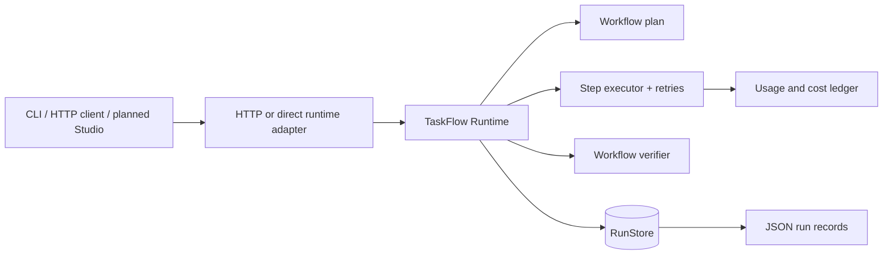
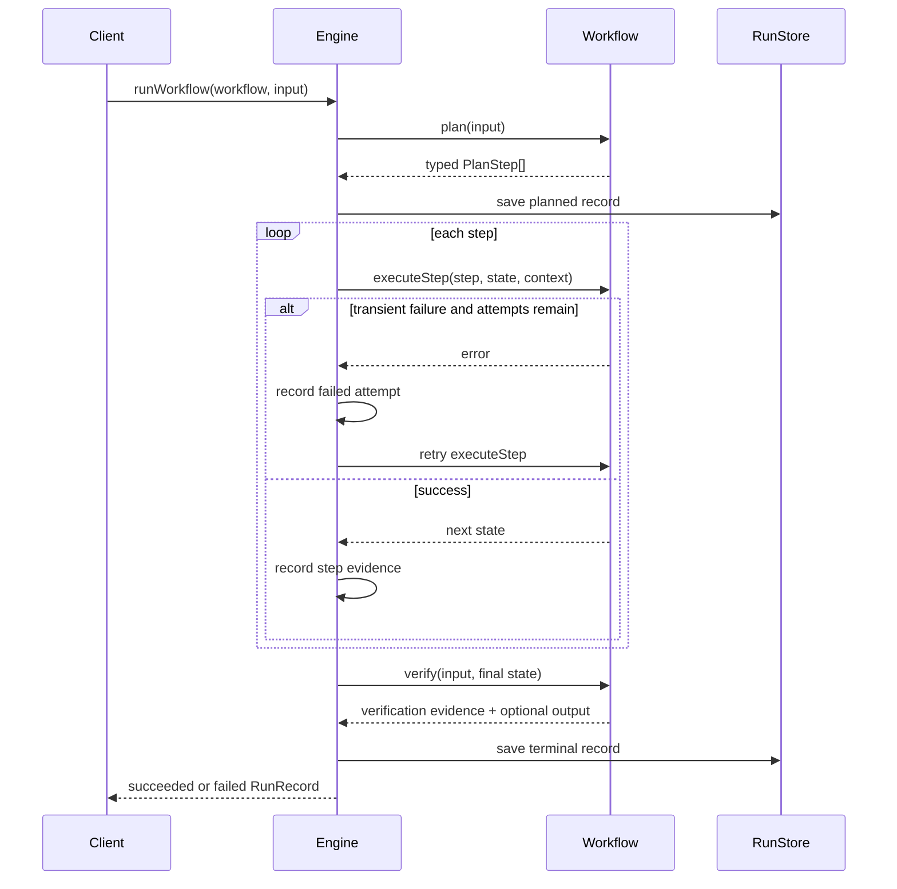

# TaskFlow Architecture

## Product boundary

TaskFlow Runtime is the implemented orchestration engine. TaskFlow Studio is a planned client that may eventually author workflow definitions and display run evidence through the runtime HTTP API. Studio does not own orchestration truth.

## Execution sequence

## Components

### `src/core/types.ts`

Defines the stable public contracts: plans, steps, events, run records, stores, verification, workflow context, and usage records.

### `src/core/engine.ts`

Owns the state transition from planned to running to succeeded/failed. It catches planning and execution errors, records evidence, and persists terminal state.

### `src/core/retry.ts`

Executes an asynchronous operation up to a positive integer attempt limit. It exposes each failure to the engine and throws `RetryExhaustedError` after the final attempt.

### `src/core/persistence.ts`

Stores one JSON file per run using write-to-temporary-file followed by atomic rename. Run IDs are restricted to safe filename characters.

### `src/core/metrics.ts`

Calculates nearest-rank percentiles, expected-outcome accuracy, valid-case completion, and total recorded cost.

### `src/workflows/client-intake.ts`

Implements the domain-specific consulting intake workflow. It does not manage files, global metrics, HTTP, or retry loops.

### HTTP adapters

`src/http/handler.ts` uses the Web `Request`/`Response` interface. `src/server.ts` adapts Node HTTP. `api/run.ts` provides a serverless-compatible `POST` export.

## Run record invariants

- Every run has one stable `runId`, `workflowId`, input snapshot, and ordered event sequence.
- A succeeded run has successful verification.
- A failed run contains an error or failed verification evidence.
- Adapter cost is the sum of explicitly recorded usage entries; unknown cost is never guessed.
- Persistence failures are surfaced rather than silently ignored.
